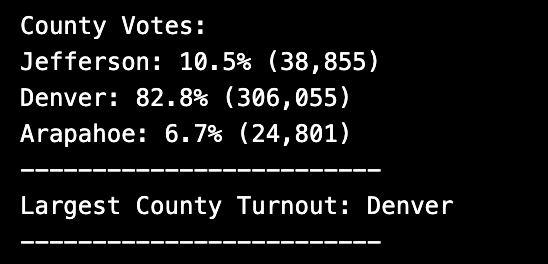
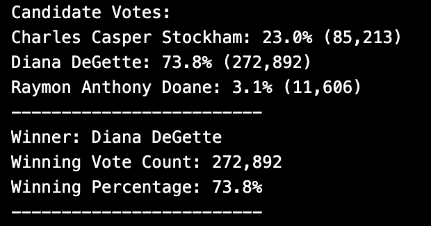

# Project Overview
The client's goal was to write code in python that could be used to tally election results.  The initial step was to write code to automattically tally votes and calculate percentages for individual candidates and select the winner.  After recieivng the candidate results, the client also wanted the code to automatically tally votes by county and select the county with the highest voter turnout.

# Results
1. The total votes cast were 369,711
2. Breakdown of County Votes:
    - Jefferson: 10.5% (38,855)
    - Denver: 82.8% (306,055)
    - Arapahoe: 6.7% (24,801)
  

3. Denver had the largest number of votes
4. Breakdown of Candidate Votes:
    - Stockham:  23.0% (85,213)
    - DeGette:  73.8% (272,892)
    - Doane:  3.1% (11,606)

5. Winning Candidate:
    - Winner:  DeGette
    - Winning Vote Count:  272,892
    - Winning Percentage:  73.8%

# Election-Audit Summary
This code can be used to tally votes for individual candidates and counties, find a candidate's percentage of votes, select the winning candiate and the county with the highest voter turnout.  The functions of this code can be used for any election given that a couple fo adjustments are made to the code.  The first adjustment is ensuring that the code is referencing the proper file containing the given election's results.  This can easily be adjsuted by replacing the file path and name in the file_to_load line of the code. A second adjustment to the code is the row[] function.  Depending on the file containing the elction results, the code specifying the row and column of the data to reference will need to be updated.  These adjustments are quick and easy to perform and once the code has been updated, results are available almost instantaneously allowing for the election commission to report results much more quickly.
